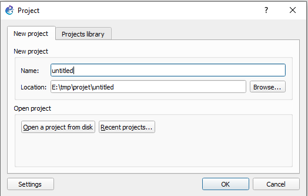

:house: [**Retour au menu principal**](/TChelp)

# Présentation de GNS3

## Qu'est ce que GNS3 ?

GNS3 est un simulateur de réseau, il sert à étudier différentes architectures réseau comme si nous les faisions en vrai.

## Installation

Vous retrouverez sur [la page de téléchargement](https://www.gns3.com/software/download) les différents OS ainsi que les guides d'installation associés. Pour télécharger GNS3, il faut obligatoirement se créer un compte. 

### Quelque commande pour plus de rapidité

- Sous Windows avec chocolatey : ``choco install gns3``

- Sous linux basé sur Ubuntu :  

  ```bash
  sudo add-apt-repository ppa:gns3/ppa
  sudo apt update                                
  sudo apt install gns3-gui gns3-server
  ```

- Sous maccOS >= 10.13 : ``braw install gns3``

## Premiers pas avec GNS3

### Ajout d'un routeur

Nous commençons par ajouter les images des routeurs [(disponible sur moodle)](https://moodle.insa-lyon.fr/mod/folder/view.php?id=87489).  

Edit -> Preferences -> IOS routers ->  

New ou ``Ctrl`` + ``Shift``+``P`` -> IOS Routers -> New

  

Choisir ``Run this IOS router on my local computer`` 


puis ``New image`` et choisir le chemin du fichier


Faire ``Next`` jusqu'au choix des slots et choisir ``PA-GE`` pour les slots 1 et 2 

 

Pour finir la configuration du routeur ``Next`` puis ``Finish``

## L'interface

Elle se découpe en plusieurs parties,<span style="color:red"> la partie centrale </span> (en rouge), notre espace de travail où l'on peut construire notre infrastructure réseaux à l'aide de switch, pc, et routeur.   

<span style="color:#00A2E8 ">A gauche</span> (en bleu), le panneau nous permet de choisir l'équipement souhaité, les logos sont assez parleur. Mais de haut en bas, nous avons les routeurs puis les switchs, puis les interfaces de navigation (Notamment les PCs) puis les périphériques de sécurités. Pour finir avec la catégorie qui les regroupes tous et boutons nous permettant de simuler les câbles.  

<span style="color:#22B14C">A droite </span>(en vert), nous avons tous les périphériques qui sont sur notre espace de travail. A l'aide de ce panneau, nous pouvons rapidement identifier les appareils en fonctionnement ou non. En double cliquant sur l'un des devices, notre espece de travail se voit centré sur celui-ci, très pratique pour retrouver des appareils sur de grosses architectures.  

En-dessous du cadre vert, nous retrouvons les machines ressources. En effet, GNS3 permet de connecter plusieurs machines afin de repartir la charge de travail (Nous sommes sur de la simulation, donc grosse charge).

Au-dessus, un barre avec des raccourcis permet d'ajouter des légendes, des cadres de couleurs. Ceci est très pratique pour l'identification des réseaux par exemple. D'autres icônes permettent :  de mettre "sous tension" toutes les machines présentes sur l'espace de travail , ou de les mettre en pause , ou des les stopper .
L'ouverture d'un terminale pour l'une des machine s'effectue en double cliquant sur l'une des machines, ou avec un clique droit puis ``console``. Le bouton  permet d'ouvrir toutes les consoles des machines en cour de fonctionnement.


### Premier projet

Au démarrage de GNS3, un fenêtre s'ouvre pour l'ouverture d'un projet. Tu peux dans cette fenêtre nommer ton projet et le placer où tu veux sur ton espace de stockage.   
Si tu veux ouvrir un projet déjà créé tu peux le chercher avec le bouton `Open a project from f disk` ou avec `Recent projects` où tu trouveras les projets récents. Tu peux aussi trouver tes projets dans l'onglet `Project library`.  
Si la fenêtre ne s'ouvre pas tu peux toujours cliquer sur  pour la création d'un nouveau projet. Ce bouton ouvre la même fenêtre. Tu peux aussi cliquer sur  pour naviguer dans tes fichiers et ouvrir un projet existant.



> :keyboard: **Shortcut**: `Ctrl` + `O` pour ouvrir un projet  
> 						`Ctrl` + `N` pour un nouveau projet

Un fois que tu as créé ton projet tu peux utiliser le panneau des équipements pour glisser-déposer des routeurs, PCs, switchs etc.

## Ressources

Vous pouvez trouver un cours plus approfondi sur [OpenClassrooms](https://openclassrooms.com/fr/courses/2581701-simulez-des-architectures-reseaux-avec-gns3)

[Le site de GNS3](https://www.gns3.com/)

Utilisation d'un serveur pour gns3 [tuto ecrit (EN)](https://luminisindia.com/it-networking-blog/168-learn-how-to-setup-gns3-server-with-the-help-of-demonstration) [tuto video (FR)](https://www.youtube.com/watch?v=fBQZbjSydrQ&list=WL&index=11&t=0s)

Utilisation de remote server pour du partage de ressources [tuto video (EN)](https://www.youtube.com/watch?v=uLRTq2-vlX8) (a revoir pck je ne l'aime pas trop, je crois que je vais me chauffer a faire un tuto pck je n'arrive pas a trouver ce que je veux mdr)

[Utilisation d'une VM sous VMware avec GNS3](https://openclassrooms.com/fr/courses/2581701-simulez-des-architectures-reseaux-avec-gns3/4823181-importez-vos-images-pour-votre-architecture)

[utilisation d'une VM sous VirtualBox avec GNS3]([https://www.it-connect.fr/importer-une-machine-virtualbox-dans-gns3%EF%BB%BF/](https://www.it-connect.fr/importer-une-machine-virtualbox-dans-gns3/))


