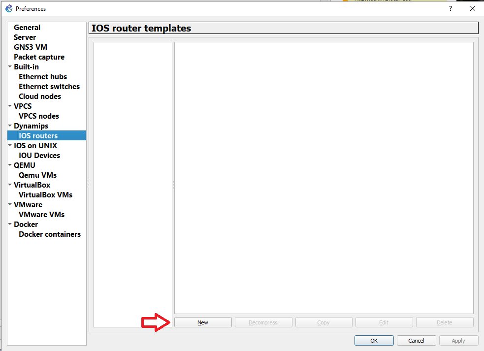
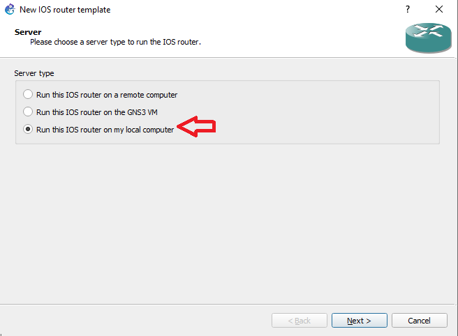
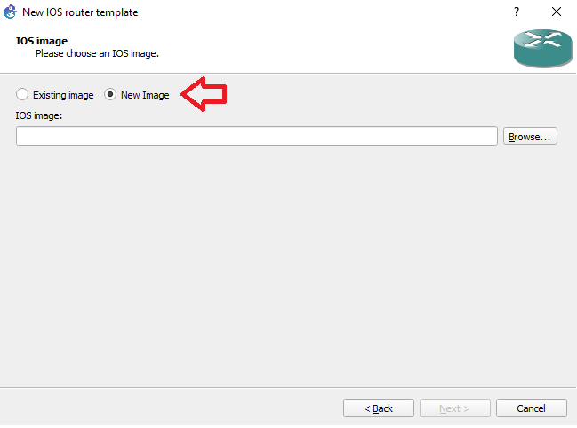
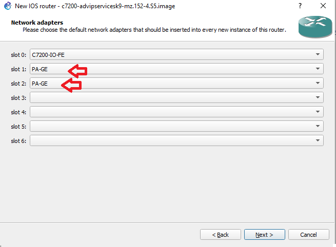
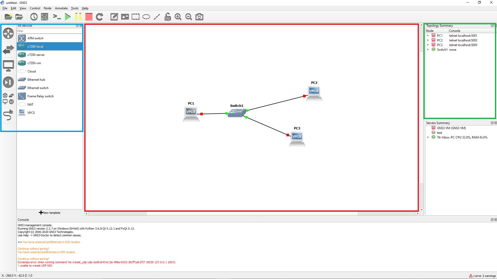

# Présentation de GNS3

## Qu'est ce que GNS3 ?

GNS3 est un simulateur de réseau, il sert a étudier différentes architecture réseau comme si nous les faisions en vrai.

## Installation

Vous retrouverez sur [la page de téléchargement](https://www.gns3.com/software/download) les différents os ainsi que les guides d'installation associé. Pour télécharger GNS3, il faut se créer un compte. 

### Quelque commande pour plus de rapidité

- Sous Windows avec chocolatey : ``choco install gns3``

- Sous linux basé sur Ubuntu :  

  ```bash
  sudo add-apt-repository ppa:gns3/ppa
  sudo apt update                                
  sudo apt install gns3-gui gns3-server
  ```

- Sous maccOS >= 10.13 : ``braw install gns3``

## Premiers pas avec GNS3

Nous commençons par ajouter les images des routeurs (disponible sur moodle).  

Edit -> Preferences -> IOS routers ->  

new ou ``ctr`` + ``shift``+``p`` -> IOS routers -> new

  

Choisir ``Run this IOS router on my local computer`` 



puis ``new image`` et choisir le chemin du fichier



Faire ``next`` jusqu'au choix des slots et choisir ``PA-GE`` pour les slots 1 et 2 

 

Pour finir la configuration du routeur ``next`` puis ``finish``

## L'interface

Elle se découpe en plusieurs partie,<span style="color:red"> la partie centrale </span>, notre espace de travail ou l'on peut construire notre infrastructure réseaux a l'aide de switch, pc, et routeur.   

<span style="color:#00A2E8 ">A gauche </span>, le panneau nous permet de choisir l'équipement souhaité, les logos sont assez parleur. Mais de haut en bas, nous avons les routeurs puis les switchs, puis les interfaces de navigations (Notamment les PCS) puis les périphériques de sécurités. Pour finir avec la catégorie qui les regroupes tous et boutons nous permettant de simuler les câbles.  

 <span style="color:#22B14C">A droite</span>, nous avons tous les périphériques qui sont sur notre espace de travail. A l'aide de ce panneau, nous pouvons rapidement identifié les appareils en fonctionnement ou non. En double cliquant sur l'un des devices, celui-ci se voit centré sur notre espace de travail, très pratique pour retrouver des appareils sur de grosses architectures.  

En dessous du cadre vert, nous retrouvons les machines ressources. En effet, GNS3 permet de connecter plusieurs machines afin de repartir la charge de travail (Nous sommes sur de la simulation, donc grosse charge).

Au dessus, un barre avec des raccourcis permet d'ajouter des légendes, des cadres de couleurs. Ceci est très pratique pour l'identification des réseaux par exemple. D'autres icones permettent :  de mettre "sous tension" toutes les machines présente sur l'espace de travail , ou de les mettre en pause , ou des les stopper .
L'ouverture d'un terminale pour l'une des machine s'effectue en double cliquant sur l'une des machines, ou avec un clique droit puis ``console``. Le bouton  permet d'ouvrir toutes les consoles des machines en cour de fonctionnement.




## Ressources

Vous pouvez trouver un cours plus approfondi sur [OpenClassrooms](https://openclassrooms.com/fr/courses/2581701-simulez-des-architectures-reseaux-avec-gns3)

[Le site de GNS3](https://www.gns3.com/)