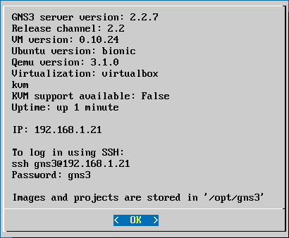
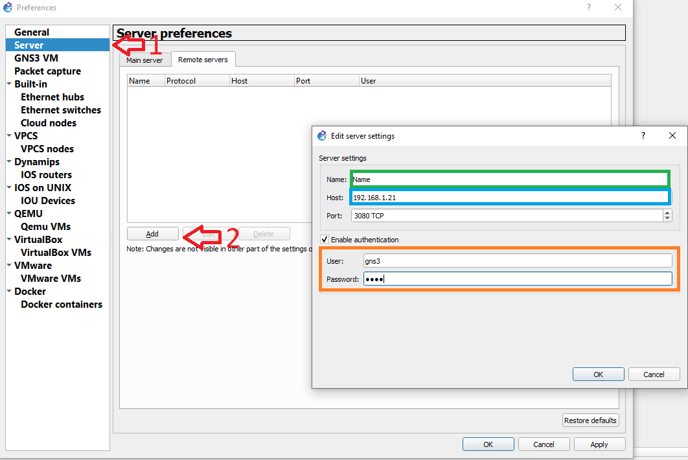
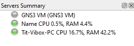

:house: [**Retour au menu principal**](/TChelp)

# Remote Server de GNS3

Vous pouvez [télécharger la VM de GNS3](https://www.gns3.com/software/download-vm) sur un ordinateur et configurer un autre ordinateur pour l'utilisation de cette VM en tant que server.
Pour ce faire, un fois la VM lancée, vous pouvez voir son adresse IP sur le récap 

On y retrouve aussi le nom d'utilisateur et le mot de passe pour la connexion.

Ici, nous avons :

- @ ip : `192.168.1.21`
- Username : `gns3`
- Password : `gns3`

Sur le second PC, allez dans ``Préférences>Server>Add`` pour ajouter un server

Dans le champs Name, indiquez un nom pour identifié la machine.
Dans le champs Host, indiquez l'adresse IP de votre machine (dans notre cas : `192.168.1.21`)
Cochez `Enable authentication` et dans les champs User et Password, indiquez le mot de passe et le nom d'utilisateur récupérer des infos de la VM (Ici, user : `gns3` et password : `gns3`)

Pour finir, redémarrez GNS3 pour appliquer les changement. Vous pourrez voir votre serveur dans la section `Servers Summary` avec l'utilisation de la RAM et du CPU.
Ex : 
