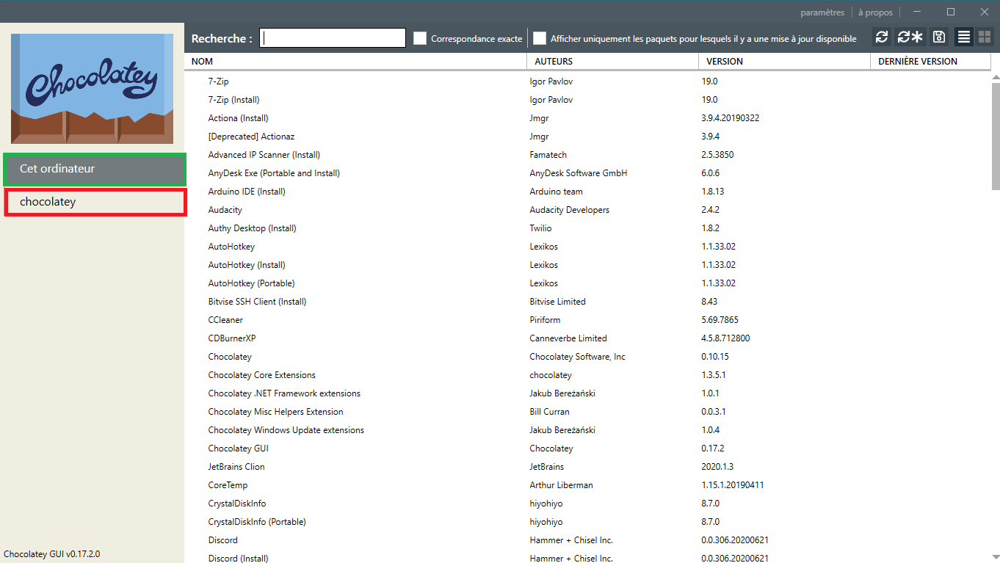

:house: [**Retour au menu principal**](/TChelp)

# Présentation de Chocolatey

## Qu'est ce que chocolatey

Chocolatey est un gestionnaire de paquet sous Windows, vous pouvez le trouvez [ici](https://chocolatey.org/)

## Comment l'installer ?

Vous retrouvez le guide d'installation [ici](https://chocolatey.org/install)
Pour résumer il faut lancer un PowerShell en **Administrateur**

Puis taper cette commande ``Set-ExecutionPolicy Bypass -Scope Process -Force; [System.Net.ServicePointManager]::SecurityProtocol = [System.Net.ServicePointManager]::SecurityProtocol -bor 3072; iex ((New-Object System.Net.WebClient).DownloadString('https://chocolatey.org/install.ps1'))``

## Comment l'utiliser ?

Pour l'utilisation vous pouvez vérifier sur le [site de chocolatey](https://chocolatey.org/search?q=) que votre application est présente
Sinon vous pouvez utiliser le ligne de commande suivante ``choco search <package name>``, la liste des applications correspondant à ce paquet s'afficherons. Pour installer le paquet voulu, il faut taper la commande ``choco install <package name>`` , vous pouvez utiliser l'option ``-y`` pour accepter directement.

Pour la mise à jour des paquets, il faut taper la commande ``choco upgrade <package name>`` et pour mettre à jour tous les paquet ```choco upgrade all`` (vous pouvez faire un script avec un lancement régulier à l'aide du planificateur de tâches)

Pour lister les applications installer, utiliser la commande ``choco list --local-only``

## Une interface graphique

Vous pouvez aussi utiliser chocolatey avec une interface graphique (GUI). Pour cela, il faut l'installer à l'aide de cette commande : `choco install chocolateygui`
Une fois installée, vous pouvez la lancer à l'aide du menu démarrer Windows en tapant `chocolatey GUI`

l'interface se présente comme ceci :



Vous pouvez voir la liste des applications installées a l'aide de l'onglet <span style="color:green">cet ordinateur</span> et effectué une recherche sur le dépôt a l'aide de l'onglet <span style="color:red">chocolatey</span>. D'autres option sont rapidement accessible comme l'actualisation des paquets ou la mise a jour de tous les paquets 

## Ressources

[Le site de chocolatey](https://chocolatey.org/)
