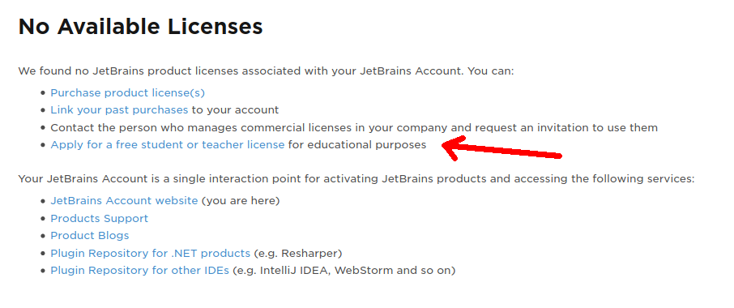
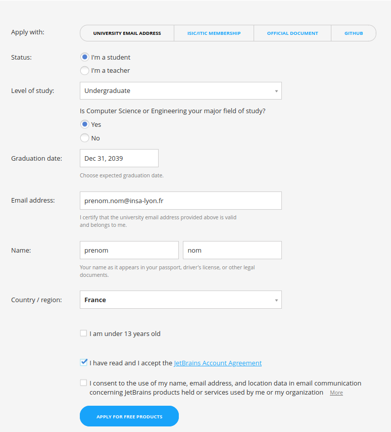
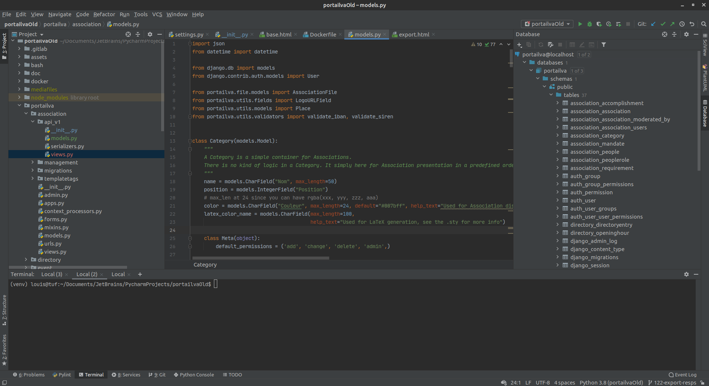

:house: [**Retour au menu principal**](/TChelp)

# Introduction à la suite JetBrains

La suite JetBrains est un ensemble d'IDE créés pour le développement professionel d'applications. Jetbrains propose un logiciel dédié pour plusieurs langages de programmation : IntelliJ pour Java, Pycharm pour Python, etc. Leurs fonctionnalités avancées et puissantes en font des incontournables, les surclassant par rapport à leurs compétiteurs sur de multiples aspects.

Grâce à votre compte étudiant et au Github Student Pack, vous avez accès gratuitement aux versions professionnelles de tous les logiciels de JetBrains pendant toute la durée de votre scolarité.

## Table des matières

- [Introduction à la suite JetBrains](#introduction---la-suite-jetbrains)
  * [Table des matières](#table-des-mati-res)
  * [Installation](#installation)
    + [Avec chocolatey (Windows)](#avec-chocolatey--windows-)
    + [Avec snap (Linux)](#avec-snap--linux-)
    + [Jetbrains Toolbox](#jetbrains-toolbox)
    + [Activation de la license étudiante](#activation-de-la-license--tudiante)
  * [Premier tour](#premier-tour)
  * [Configuration de l'utilisation des DevTools](#configuration-de-l-utilisation-des-devtools)
  * [Raccourcis clavier](#raccourcis-clavier)
    + [Raccourcis pour git](#raccourcis-pour-git)
    + [Raccourcis pour l'édition](#raccourcis-pour-l--dition)
- Installation

NB: L'installation des dev tools de chaque langage de programmation est nécessaire pour l'utilisation de l'IDE.

### Avec chocolatey (Windows)

`choco install pycharam`
`choco unstall inteliji`

### Avec snap (Linux)

`sudo snap install pycharm-professional --classic`

`sudo snap install intellij-idea-ultimate --classic`

### Jetbrains Toolbox

JetBrains propose aussi [un launcher pour leurs IDE](https://www.jetbrains.com/toolbox-app/), bien pratique si vous en utilisez plusieurs

### Activation de la license étudiante

Pour profiter de l'offre étudiante donnant accès gratuitement à tous les logiciels de la suite. Après avoir créé un compte et validé votre email, rendez vous sur le menu *Licenses*, puis *Apply for a free student or teacher license* : 

Puis dans *For student and teachers*, *Apply*:

Enfin, remplissez le formulaire en précisant votre adresse INSA. Le site va reconnaître que l'INSA est un établissement éligible à l'offre étudiante.

Après validation de l'email sur votre boîte INSA, vous trouverez un numéro de license sur le menu *Licenses*. Ce numéro vous servira à activer le logiciel au premier lancement

## Premier tour

Tous les logiciels de la suite partagent la même interface, qui ressemblera toujours à peu de choses près à ceci : 

Sur la gauche, les fichiers du projet ouvert. Le code couleur correspond à l'état du fichier dans le système de contrôle de version (VCS) : 

* En jaune, les fichiers ignorés par le VCS
* En Bleu, les fichiers modifiés depuis le dernier commit (*unstaged*)
* En vert, les fichiers crées et ajoutés au VCS. Lors de la création manuelle d'un fichier, l'IDE vous propose de l'ajouter aux changements du commit (effectue un `git add`)
* En rouge, les fichiers créés non ajoutés au commit, sans suivi des modifications.
* En blanc, les fichiers non modifiés depuis le dernier commit

Sur le bas, plusieurs onglets, avec notamment un terminal accessible, et une interface graphique pour git.

Sur la droite, un menu *Database* qui peut se connecter à vos bases de données (même dockerisées), proposant des outils d'inspection de tables et un prompt pour faire des requêtes, très utile pour du debug web.

En haut à droite, 3 boutons pour les opérations de base du VCS : commit, push, pull, avec une interface graphique agréable pour sélectionner et revoir les changements et ne pas pousser de config en production (hum).

À leur gauche, les options de lancement et d'édition des configurations. Pensez à ces options pour lancer plus facilement votre projet.

Au milieu, l'éditeur, avec à droite un aperçu des erreurs et avertissement. Ces warnings ont souvent raison, essayez de maintenir un code sans aucune barre jaune à droite

## Configuration de l'utilisation des DevTools

La configuration de base de l'interpréteur/compilateur est souvent mauvaise, rétablissez les inspections du code en allant dans

`File -> Settings -> projects -> interpreter` 

## Raccourcis clavier

### Raccourcis pour git

ctrl+k = commit  
ctrl+shift+k = push

ctrl+t = pull

### Raccourcis pour l'édition

Quelques raccourcis indispensables pour faciliter l'édition :

ctrl+d = dupliquer la sélection ou la ligne  
ctrl+shit+alt+clic = sélection multiple pour édition  
ctrl+/ = commenter / uncommenter  
ctrl+shift+f10 = lancer le fichier courant  
ctrl+f10 = lancer le dernier fichier

ctrl+alt+maj+l = reformater le cod

ctrl+tab = changer de fichier à éditer

alt+shift sur un warning/erreur = voir les propositions de correction

ctrl + b = aller à la définition/aux usages d'une fonction ou attribut

## Ressources

[Tips and tricks by JetBrains (video)](https://www.youtube.com/watch?v=NoDx0MEESDw&t=463s)
[Tips and tricks by JetBrains (website)](https://www.jetbrains.com/pycharm/guide/playlists/42/)
[Quelques raccourcis clavier (video)](https://www.youtube.com/watch?v=9fxBvbEvAxY)
