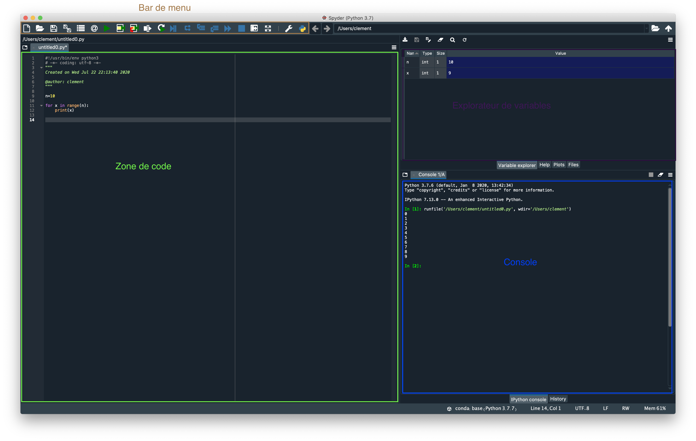

:house: [**Retour au menu principal**](/TChelp)

# Spyder

> © Icône officielle de l'application

## Qu'est ce que Spyder ?

Spyder est un environnement de développement pour Python assez utilisé dans le milieu scientifique.

## Comment installer spyder ?

Spyder est inclus dans la distribution Anaconda disponible [ici](https://www.anaconda.com/products/individual)

## Présentation de spyder

### Généralités

Vous retrouvez 4 zones principales :

- La bar de menu : vous avez tout ce dont vous avez besoin, survolez les icônes avec votre souris pour savoir à quoi ils servent
- La zone de code : c'est là où vous codez votre projet
- L'explorateur de variable : très utile pour le debug, c'est ici que vous verrez les valeurs de vos variables
- La console : entrée/sortie de ce que vous faites

Faites F5 pour lancer le code en cours dans la console.
