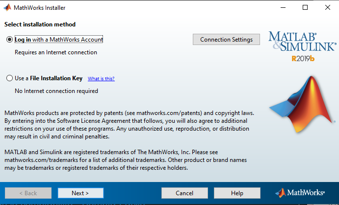
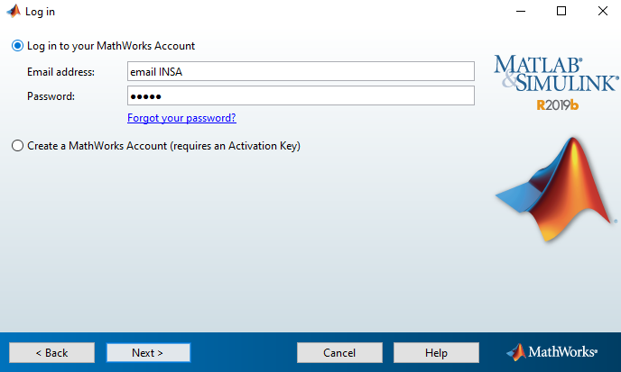
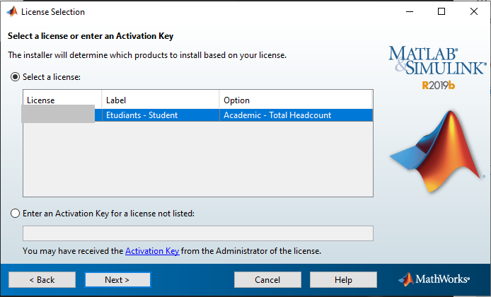
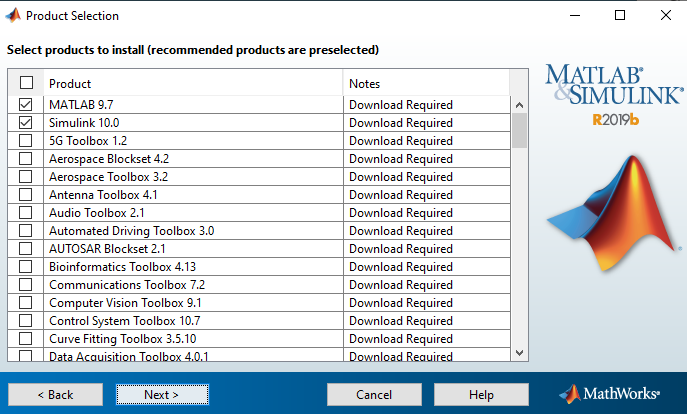

# Matlab

## Qu'est ce que Matlab

C'es un langage de script émulé par un environnement de développement. Il est utilisé dans le calcul numérique, de manipuler des matrices, des graphiques. Il permet aussi de créer des interfaces. S'interface avec d'autre langage comme le C, C++, Java et Fortran. 
Il est utilisé par de nombreuses personnes et dans différents domaine comme l'industrie, la recherche. 
Matlab peut s'utilise avec des toolboxes qui permettent d'autres utilisations.

## Installation

Pour installer Matlab, une licence est nécessaire. Cette licence est disponible avec votre adresse INSA. Tu peux le vérifier que tu as bien une licence [ici](https://fr.mathworks.com/academia/tah-support-program/eligibility.html). Et t'inscrire pour télécharger Matlab [ici](https://fr.mathworks.com/mwaccount/register?uri=https%3A%2F%2Ffr.mathworks.com%2Fproducts%2Fget-matlab.html%3Fs_tid%3Dgn_getml). Une fois ton compte enregistrer, tu peux te rendre [sur la page de téléchargement](https://fr.mathworks.com/downloads/web_downloads/select_release) pour obtenir une version de Matlab. Au départ la R2018b est installé, nous te conseillons d'installé cette version pour éviter tous problèmes de compatibilité. Choisie ensuite ton OS et télécharge le fichier d'installation. 
Sur Windows la fenêtre d'installation commence par demander comment activer la licence, choisie `Log in with a MathWorks Account ` puis clique sur `next`. 

Tu dois ensuite accepter les conditions d'utilisation et te connecter. Utilise ton adresse INSA et le mot de passe que tu as créée lors de ton inscription à math Works.

 

Choisie ensuite la licence et `next`

Tu seras invité a choisir le lieux installation, je t'invite a le laisser par défaut. Tu peux donc cliquer sur `next` . Et tu dois maintenant choisir les toolboxes. Les toolboxes que tu as besoin sont : Simulink / .... (Ne inquiète pas, tu peux télécharger les toolboxes après l'installation)

Pour finir tu peux cliquer sur `next` puis `insatall`  
L'installation de Matlab est relativement longue même avec un bonne connexion.