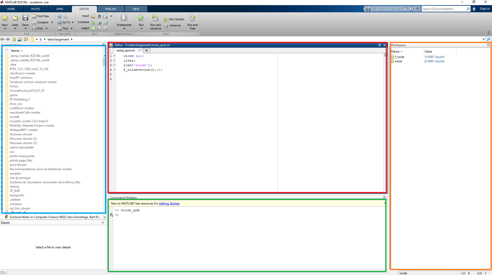
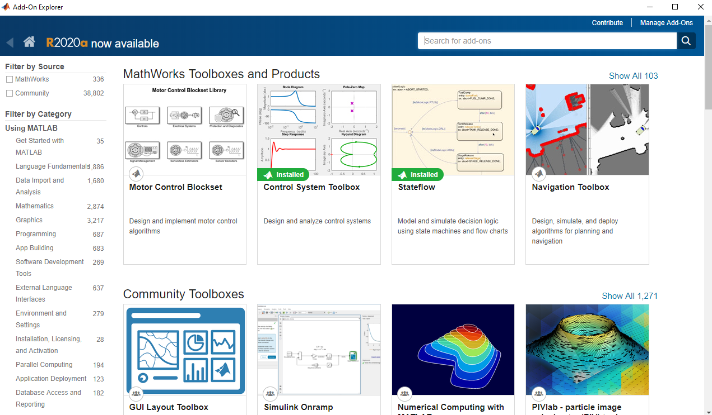

:house: [**Retour au menu principal**](/TChelp)

# Matlab

## Qu'est ce que Matlab
Matlab est un outil de simulation numérique. Il est utilisé dans le calcul numérique, dans la manipulations d'objets mathématiques comme les matrices, les courbes... Il permet de créer des interfaces de visualisation et s'interface avec d'autres langages comme le C, C++, Java et Fortran.
Il est utilisé dans tous les projets de simulation de systèmes.
Matlab peut s'utiliser avec des boîtes à outils (toolboxes) qui permettent de coupler la simulation mathématiques à des simulation d'environnements physiques.

## Installation

Une licence matlab est disponible avec votre adresse INSA. Tu peux vérifier que tu as bien une licence [ici](https://fr.mathworks.com/academia/tah-support-program/eligibility.html), et t'inscrire pour télécharger Matlab [ici](https://fr.mathworks.com/mwaccount/register?uri=https%3A%2F%2Ffr.mathworks.com%2Fproducts%2Fget-matlab.html%3Fs_tid%3Dgn_getml). Une fois ton compte enregistré, tu peux te rendre [sur la page de téléchargement](https://fr.mathworks.com/downloads/web_downloads/select_release) pour obtenir une version de Matlab. Au département la R2020a est installée, nous te conseillons d'installer cette version pour éviter tous problèmes de compatibilité. Choisi ensuite ton OS et télécharge le fichier d'installation.
Sur Windows la fenêtre d'installation commence par demander comment tu souhaites activer ta licence, choisi `Log in with a MathWorks Account ` puis clique sur `next`.

Tu dois ensuite accepter les conditions d'utilisation et te connecter. Utilise ton adresse INSA et le mot de passe que tu as créée lors de ton inscription à MathWorks.

Choisi ensuite la licence et `next`

Tu seras invité a choisir le lieux d'installation, je t'invite à le laisser par défaut. Tu peux donc cliquer sur `next`. Et tu dois maintenant choisir les toolboxes. Les toolboxes que tu as besoin sur les trois ans sont (ne inquiète pas, tu peux télécharger les toolboxes après l'installation) :
- Audio System Toolbox 
- Communications Toolbox
- Communications Toolbox Support Package for USRP Radio
- Deep Learning Toolbox
- DSP System Toolbox
- Image Processing Toolbox
- Signal Processing Toolbox
- Simcape
- Simulink
- Simulink Control Design 
- Simulink Dektop Real-Time
- Simscape Electrical
- Statistics and Machine Learning Toolbox
- Symbolic Math Toolbox
- Wavelet toolbox

Pour finir tu peux cliquer sur `next` puis `install all`. 
L'installation de Matlab est relativement longue même avec un bonne connexion.

## Présentation de l'interface

Elle se présente de cette manière : 

En bleu, un explorateur de fichier permettant de naviguer entre les différents fichiers du projet.
En rouge, une zone d'édition de texte permettant de modifier le code.
En vert, une console permettant exécuter des commandes en mode interprété ou de lancer des scripts. 
En orange, les variables en cours d'utilisation, très pratique pour savoir la valeur d'une variable rapidement.
Et une barre d'outils, comme sur la majorité des logiciels, en haut. Elle te permettra de lancer des scripts, de lancer le mode debug, créer/importer de nouveaux fichiers, ajouter des add-ons rapidement, etc.

## Ajout d'add-ons 

Si il vous manque des toolboxes (non installé lors du setup par exemple) ou que vous avez besoin d'un module spécifique, dans la barre d'outils, menu `Home` vous trouverez un bouton  qui vous permettra de les installer.
En cliquant sur le bouton, cette interface va s'ouvrir : 

Pour installer une toolbox, rien de plus simple, utilisez le champs de recherche. Un fois la toolbox trouvée et que vous êtes sur sa page, cliquez sur `Add`. Ici, il est possible que Matlab vous demande de vous reconnectez. Utilise le même login/mot de passe que pour l'installation.
