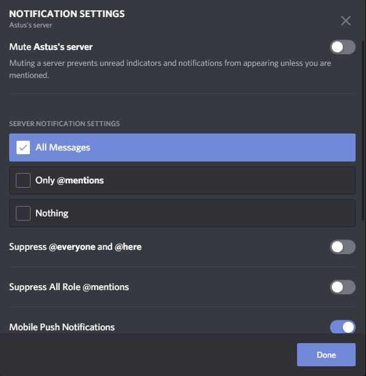

:house: [**Retour au menu principal**](/TChelp)

# Création d'un serveur Discord

## Si vous vous connectez pour la première fois

Si c'est la première fois que vous vous connectez à Discord et que vous souhaitez créer votre propre serveur, vous arriverez sur la page suivante :

 

 > Interface utilisateur lors de la première connexion

Dans cette partie, nous allons traiter de la création du serveur en question. Après avoir sélectionné "Create", vous serez redirigé vers les outils vous permettant de faire l'initialisation de votre futur serveur.

 > Affichage utilisateur lors de la création d'un nouveau serveur

Vous pouvez ici choisir l'icône du serveur. Le format minimal pour les icônes est 128x128. Si vous souhaitez sélectionner une partie spécifique d'une grande image, coupez-la en multiples de 128 (128X2=256, 128X3=384, etc.).

Il est ensuite nécessaire de choisir la région de votre serveur
 

  > Interface de sélection de la région du serveur

Une fois ces éléments, votre serveur est créé ! Félicitations !

## Si vous avez déjà un compte

Si vous êtes déjà un utilisateur de Discord, vous pouvez créer un nouveau serveur en utilisant l’icône ``+`` dans la liste de vos serveurs déjà rejoins, en bas à gauche de votre écran.

 

## Paramétrer votre serveur

- Par la suite, vous pourrez configurer les paramètres de votre nouveau serveur. Pour ce faire, vous pouvez cliquer sur le nom de votre serveur, qui s'affiche désormais en haut à gauche de votre écran, et voir apparaître un menu déroulant contenant les différents paramètres réglables.

- La section "inviter des utilisateurs" des paramètres permet de générer un lien à partager avec les autres utilisateurs que vous voulez inviter dans votre serveur.

- Un second paramètre peut indiquer si, par défaut, le serveur enverra ou non des notifications aux différents utilisateurs lorsque des messages sont envoyés sur les discussions. (Ce paramètre est personnalisable par la suite par l'utilisateur)

- L'attribution des rôles est un élément clef de la mise en place du serveur. Dans le menu déroulant des paramètres déroulants vu plus tôt, on peut sélectionner "Rôles", et venir utiliser l’icône ``+``.

Ils peuvent être spécifiques à chaque serveurs, et permettent de gérer une hiérarchie dans la serveur. Ils servent à décrire ce que peut contrôler l'utilisateur.
L'accès à certaines chaînes peuvent être modérés en fonction des rôles des utilisateurs. Certains pourront accéder à des channels, d'autres non.
En faisant un clic droit sur le nom de l'utilisateur ayant rejoint votre serveur, vous pouvez ainsi modérer ses rôles pour lui donner ou retirer des accès à certaines fonctionnalités de votre serveur.

## Créer des channels et des catégories

Comme vu précédemment, Discord possède plusieurs types de channels ( [Présentation de Discord](presentation.md) ).

Dans le menu déroulant des paramètres, on peut venir sélectionner l'option "Créer un channel". Par la suite, vous pourrez nommer et donner le type de channel à créer.

La section "catégorie" fonctionne de manière similaire.

## Pour aller plus loin

- Si vous souhaitez créer un serveur à partir d'un "modèle"
Un tutoriel à ce sujet existe déjà !   : [Un model de serveur pour les cours](Serveur_model_cours.md)
