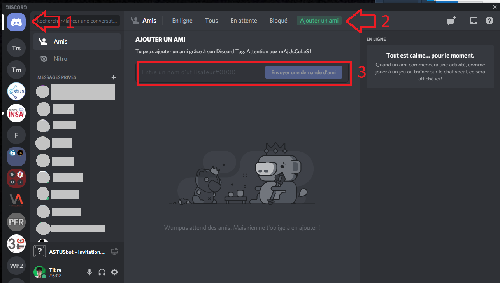
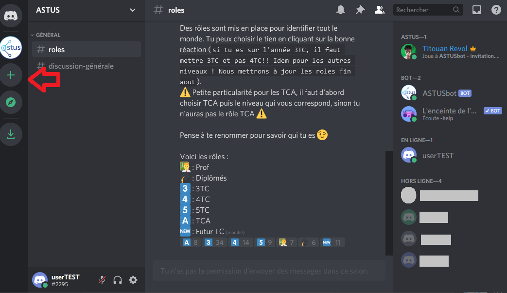
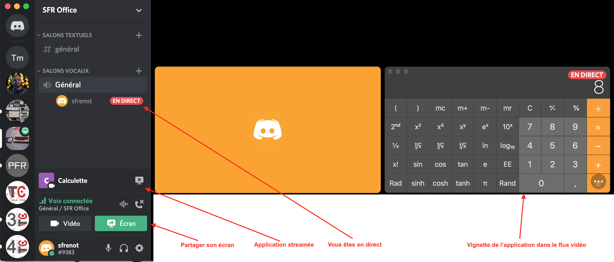
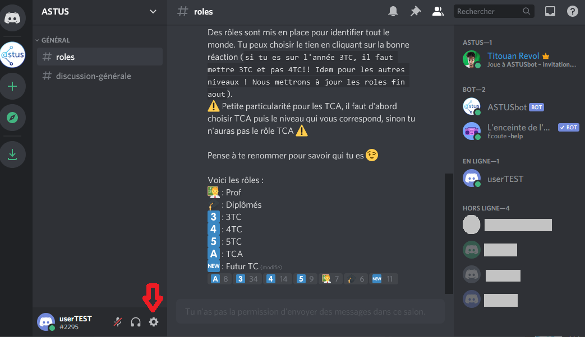
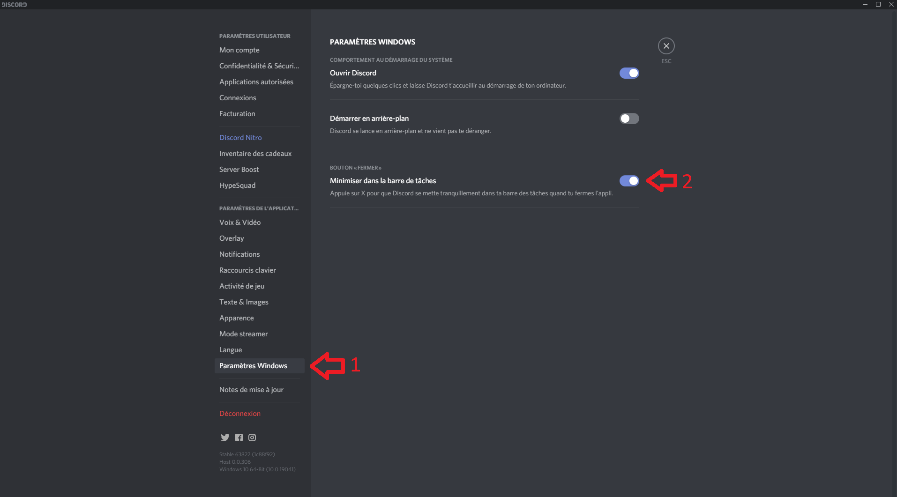

:house: [**Retour au menu principal**](/TChelp)

# Discord

 
 >  © Icône officielle de l'application

## Qu'est ce que Discord

Discord est un logiciel de chat, de VoIP et de streaming conçu initialement pour les communautés de joueurs en ligne puis s'est démocratisée récemment vers le grand public.  
Son utilisation est basée sur des espaces personnalisables que Discord appelle serveurs.  Un serveur permet de structurer des canaux de communication. Un canal peut être de type texte ou vocal. Discord permet d'établir des communications éphémères vocales ou textuelles, entre deux utilisateurs amis, dans un groupe d'utilisateurs amis, ou sur un serveur spécifique.
Discord doit son succès, entre autre, aux éléments suivants :
- Simplicité de mise en œuvre des canaux de discussion.
- Souplesse de gestion des droits d'administration d'un serveur.
- Efficacité des communications.

Discord est cependant un site nord-américain. Le serveurs sont herbergés sur des machines virtuelles dans le cloud de Google. Le business-model de l'entreprise est la captation des données pour faire de l'analyse marketing et publicitaire des profils utilisateurs. L'intégralité des données est captée. L'utilisateur de ce type d'outil doit donc rester conscient des enjeux liés à la captation de données personnelles.

## Installation

Vous retrouverez les exécutable et paquets en fonction de votre OS sur [la page de téléchargement](https://discord.com/download) de Discord. Vous pouvez également utiliser un gestionnaire de paquets pour l'installation.

Discord peut être utilisé dans un navigateur Web ou comme une application autonome.

:muscle: Nous recommandons l'utilisation en application autonome car elle permet d'accéder à toutes les fonctionnalités.


L'interface utilisateur de Discord se lit en colonnes, et de gauche à droite.
1. La première colonne indique les serveurs que vous avez rejoints. Vous pouvez accéder à un menu contextuel pour y réaliser vos actions autorisées. Le premier serveur de la liste est votre Accueil. Vous accédez à la liste de vos amis ainsi que vos groupes de discussion personnels. Le bouton '+' en bas de cette liste vous permet de rejoindre un serveur existant ou de créer votre propre serveur. N'hésitez pas à tester cette dernière fonctionnalité. (Tuto disponnible [ici](ServeurCreation.md).)

2. La seconde colonne s'affiche quand vous sélectionnez un serveur spécifique. Vous ne pouvez interagir avec les utilisateurs d'un serveur qu'en sélectionnant le serveur concerné. Cette colonne liste l'intégralité des salons de discussion. Une icône permet de distinguer les salons à connexion vocale des salons à connexion texte. La structuration de cette zone est à la charge des administrateurs du serveur. Dans le cas de TC l'organisation des groupes de canaux se fait en fonction des cours.
En bas de cette colonne, un rectangle indique votre statut de connexion et de profil. Vous y voyez votre pseudo et votre numéro utilisateur. Si le texte dans cette zone est Orange vous avez une connexion défaillante. S'il ne s'agit que de la voix, les canaux voix et vidéo seront défectueux.
3. La troisième colonne indique soit une zone de discussion texte, soit une zone d'affichage de vignettes graphiques dans un canal vocal.

Vous ne pouvez voir qu'une seule fenêtre de chat ou de video à la fois. Lorsque vous êtes connecté à un canal vocal, vous pouvez changer pour aller sur un canal texte. Sur un canal vocal vous pouvez streamer ou visualiser un stream.

## Première connexion

Pour communiquer avec quelqu'un, vous avez deux options :

- Envoyer une demande d'ami pour discuter en direct avec lui. Pour ajouter un ami, il faut aller dans l'accueil de Discord (1) puis cliquer sur `Ajouter un ami` (2). Et pour finir taper l'id de votre ami sous la forme `user#1234`. Son id est visible dans son statut en bas à gauche de la seconde colonne.
  

- Rejoindre un serveur et parler sur des canaux. Pour rejoindre un serveur, il faut avoir le lien d'invitation du serveur. Ce lien se présente sous la forme `https://discord.gg/[des caractères alphanumériques]`. Vous pouvez ajouter le serveur en cliquant sur le `+` dans la liste des serveurs.
  
  

Vous pouvez recevoir le lien directement dans un chat discord ou par mail. L'ajout du serveur est alors automatique sur le clic.

Les liens d'invitation discord peuvent être limités en temps ou en nombre de tentatives. Si le votre n'est plus valable vous pouvez en redemander un à l'administrateur du serveur. Une fois abonné à un serveur vous pouvez en sortir pour deux raisons. Vous décidez de quitter le serveur avec le menu contextuel, ou l'administrateur peut décider de vous expulser du serveur. Enfin certaines invitations donnent un statut temporaire quand vous quittez les canaux de chat, vous êtes automatiquement expulsé du serveur. Certains enseignants TC utilisent cette fonction pour vous inviter dans leurs bureaux virtuels et vous sortir du serveur à la fin de la réunion.

Félicitations, vous avez rejoint un serveur. Vous pouvez maintenant utiliser les différents canaux mis en place avec les droits attribués. Certains canaux peuvent ne  pas être accessibles.

Vous ne pouvez voir qu'une seule fenêtre de chat ou de video à la fois. Lorsque vous êtes connecté à un canal vocal, vous pouvez changer pour aller sur un canal texte. Vous conserverez la discussion vocale. Sur un canal vocal vous pouvez streamer ou visualiser un flux vidéo.

### Partager son écran : Les streamers

Un streamer est un utilisateur qui diffuse une vidéo à partir de son poste de travail. Discord est initialement fait pour les communautés de joueurs qui peuvent diffuser la vidéo de leur progression dans un jeu et les participants au canal peuvent suivre et commenter cette diffusion en direct.
Dans le cas de TC, nous l'utilisons pour streamer les contenus de cours des enseignants, ou pour visualiser un texte ou un code d'un étudiant pour l'aider sur un bug ou une erreur. C'est un mode d'interaction extrêmement efficace, qui se permet de 'montrer son écran'...

Vous pouvez streamer deux choses différentes : votre écran tel que vous le voyez ou une application en cours d'exécution.
:muscle: Nous vous suggérons ne partager le minimum de choses. Dans ce cas, essayer de se limiter au partage de l'application.

L'image précédente montre l'interface de streaming d'un utilisateur qui diffuse sa calculatrice.

Lorsque vous streamez dans un canal, un icône l'indique, et n'importe quel participant dans le canal peut visualiser le stream.

## Quelques conseils quand vous arrivez sur un canal vocal
:muscle: Coupez votre micro.
Essayez de n'activer votre micro que lorsque vous devez intervenir. Surtout s'il y a beaucoup de monde connecté. Par exemple, on peut vous entendre taper au clavier pendant une discussion, ce qui peut être très dérangeant pour l'orateur.

:muscle: Activez votre caméra uniquement lorsque c'est nécessaire.
La vidéo est assez consommatrice de bande passante. La majorité du temps c'est un accessoire inutile pour les discussions. Vous pouvez l'activer en début et en fin de session pour dire bonjour et au revoir, mais vous pouvez la conserver éteinte le reste du temps.

### Éteindre discord

Et non, cliquer sur la croix de la fenêtre ne ferme pas Discord... Cela le met en arrière plan.

Sur Windows, la solution radicale et d'aller le chercher dans le gestionnaire des tâches. La solution plus propre est d'aller dans la barre de tâche (en bas à droite) et de quitter l'application avec un clic droit.
Mais cette fonctionnalité peut être modifiée en allant dans les paramètres avec la roue crantée en bas a gauche de l'application.


Puis aller dans la section `Paramètres Windows`  (1) et cliquer sur `Minimiser dans la barre des tâches` (2) pour décocher l'option



Maintenant, en cliquant sur la croix de la fenêtre, tu fermeras vraiment l'application

Sur MacOS, c'est pareil... Fermer la fenêtre d'une application n'arrête pas son exécution. Pour voir les applications en cours d'exécution vous pouvez utiliser la combinaison de touches `CMD + TAB`. Vous pouvez basculer sur l'application que vous voulez. Pour quitter une application sous MacOs, le plus simple est certainement le raccourci `CMD + Q`.

## Utilisation avancée
### Mentionner quelqu'un ou un groupe de personne

Il est possible de mentionner sur Discord, le plus basique est de mentionner un utilisateur. Il faut utiliser le `@` suivi du nom d'utilisateur de la personne ou de son alias sur le serveur.
Vous pouvez aussi mentionner plusieurs personnes à l'aide des rôles du serveur. Tous les rôles ne sont pas forcement mentionnable, en fonction de la configuration. Pour mentionner, la procédure est identique que celle d'un seul utilisateur mais avec le nom du rôle.
Un autre type de mention est mis en place sur tous les serveurs discord. Elle permet de mentionner toutes les personnes qui ont accès au channels ou tout le monde sur le serveur. Vous pouvez utiliser cette mention avec respectivement `@here` ou `@everyone`.

:warning: Les mentions `@here`et `@everyone` sont des mentions qui peuvent toucher un grand nombre d'utilisateurs donc à utiliser avec retenue. Il est possible de désactiver l'utilisation de ces mentions sur un serveur ou de les restreindre a rôle si il y a abus.

### Intégration de code

Quand tu écris des messages textuels, tu peux ajouter du code avec de la coloration syntaxique automatique. Cette coloration est possible grâce à la syntaxe markdown.
L'utilisation se fait avec des  "`` ` `` " :warning:, ce n'est pas des apostrophe mais des accents ( :keyboard: : ``Alt gr`` + ``7`` ).  
Une seule ligne de code peut écrire: `` `<span style="color:red"> test </span>` `` ou ``` ``<span style="color:red"> test </span>`` ```  
Plusieurs lignes de code html s'écrivent :

```
​```html
<!DOCTYPE html>
<html>
	<head>
		<title>Title of the document</title>
	</head>

	<body>
		The content of the document......
	</body>

</html>
​```
```

`html`, doit être remplacé par le bon langage pour activer la coloration correspondante à python, c, javascript, css, java, bash, etc.

### Quelques raccourcis clavier
- La syntaxe dans le chat `s/toto/titi`, permet de remplacer dans le message précédent toto par titi.
- Cheat-sheet de quelques raccourcis : `/`
- Pendant la rédaction de message, ces raccourcis permettent d'utiliser la syntaxe markdown rapidement :
  - `Ctrl` + `I` permet d'écrire en italique
  - `Ctrl` + `B` permet d'écrire en gras
  - `Ctrl` + `U` permet d'écrire souligné
- Pour reload discord sans avoir à l'éteindre et le relancer : `Ctrl` + `R`
- Navigation rapide `Ctrl` + `K`

Vous pouvez aussi ajouter vos propre raccourcis clavier dans les paramètres.

## Ressources

[Un model de serveur pour les cours](Serveur_model_cours.md)

[Creation d'un serveur](ServeurCreation.md)

[Le site de Discord](https://discord.com/)
