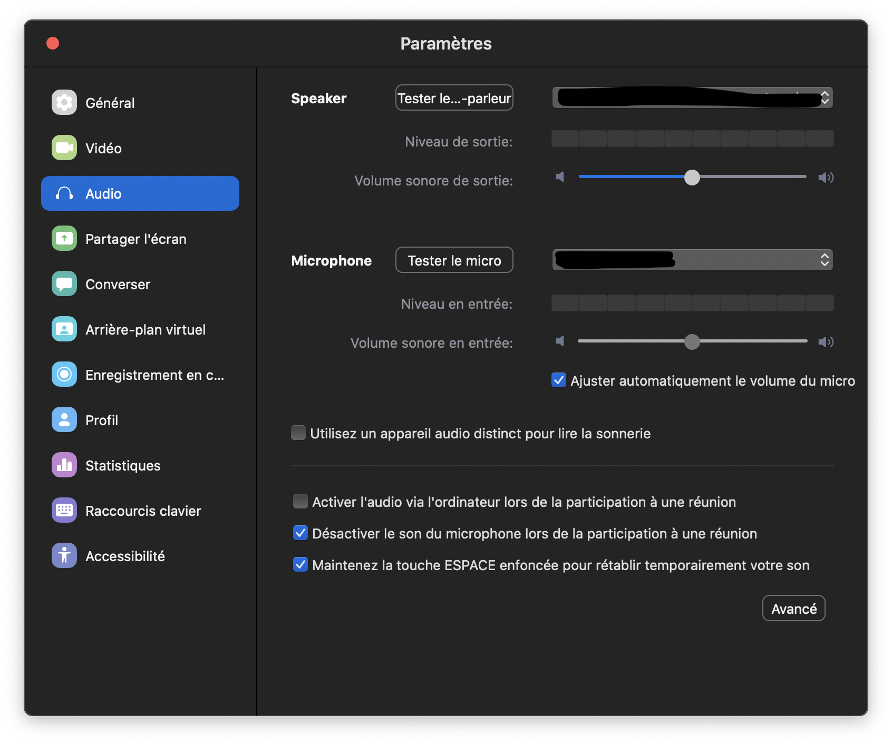
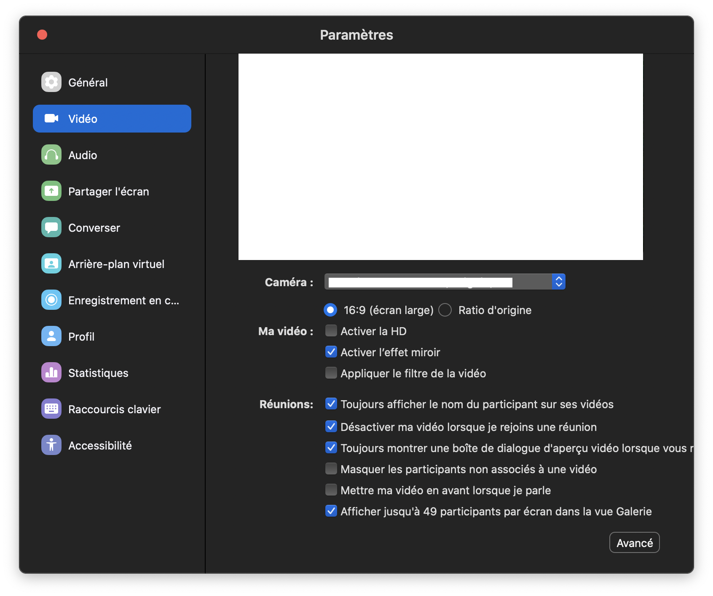

Avant propos : vous retrouverez un bon nombre de tutoriels officiels [ici](https://support.zoom.us/hc/fr/articles/206618765-Didacticiels-vidéos-Zoom)

# Zoom

>© Icône officielle de l'application

# Qu'est ce que Zoom

Zoom est un logiciel de visioconférence très utilisé dans le milieu professionnel et parfois pour des cours à l'INSA de Lyon.
Cet outil est très pratique lors de grandes réunion de type amphithéâtre et lorsque la vidéo est nécessaire (les autres outils étant principalement basé sur la VoIP et non sur la vidéoconférence).
Cependant, la durée des réunion est limitée (à 4h avec vos identifiants INSA normalement).
De plus, Zoom est assez simple d'utilisation.

# Installation

Vous trouverez les exécutables sur [la page de téléchargement](https://zoom.us/fr-fr/zoomrooms/software.html).

Par la suite, il est possible d'utiliser l'application de manière anonyme pour ce qui est de rejoindre des réunions déjà existantes (l'hôte n'aura qu'à envoyer le lien de la réunion aux différents participants). A l'inverse, il est nécessaire de créer un compte pour pouvoir accéder à plus d'options (dont le fait de pouvoir créer une réunion, pour ensuite y inviter d'autres utilisateurs).

# Prise en main de l'interface

L'interface de l'application est très simple.  Elle affiche directement à l'utilisateur les différentes possibilités qui s'offrent à lui lorsqu'il a créé son compte.
Attention : l'interface n'est visualisable que par les utilisateurs ayant souscrit un compte.

La section ``Chat``  permet de suivre des conversations textuelles tenues dans l’application.
La section `` Réunions`` permet de planifier une réunion.
La section ``Contacts`` permet de visualiser  les contacts ajoutés dans Zoom.

# Modes d'utilisation

## Rejoindre une conférence

Pour rejoindre une réunion, si vous avez reçu un lien pour rejoindre directement, cliquez dessus et Zoom s'ouvre automatiquement. Il faut bien entendu que l'application ait été installée au préalable.

Sinon, vous pouvez rejoindre en cliquant sur "Rejoindre une conférence" au lancement de l'application. Saisissez ensuite l'ID de la réunion, et le pseudonyme que vous souhaitez utiliser.

## Créer une conférence

Pour accéder à cette option, il vous faut créer un compte. Au lancement de l'application, cliquer sur "Nouvelle Réunion". La Webcam du PC se lance automatiquement, et l'application demande à rejoindre la réunion via l'audio de l'ordinateur.  L'interface visualisée à ce moment là sera la suivante :

## La barre d’outils générale

En bas de la fenêtre, vous pouvez voir plusieurs icones :

``Rejoindre l'audio`` qui permet de venir modifier les paramètres audio de votre micro

``Arrêter la vidéo`` qui permet de gérer le flux vidéo de votre webcam

``Inviter`` qui permet d'ajouter d'autres participants, et ``participants`` qui permet de visualiser ceux déjà présents.

``Partager l'écran`` vous permet d'afficher sur l'écran des autres participants l'affichage que vous avez de votre écran, que ce soit une fenêtre en particulier ou l'intégralité de votre écran.

``Converser`` permet d'accéder au chat textuel de l'application, avec les différents participants de la réunion.

``Enregistrer`` permet d'enregistrer le flux vidéo de votre vidéoconférence

Si vous souhaitez inviter des participants, la sélection de l'icone ``Inviter`` mènera à une redirection vers vos contacts, pour leur partager le lien de la réunion. De  même, vous pouvez sélectionner "E-mail" pour envoyer ce lien d'invitation à vos contacts par mail.

## Planifier une réunion

Zoom propose également de planifier des réunions. Pour cela, depuis l’onglet Accueil de l’application, cliquez sur **Programmer** au lancement de l'application.

Vous pourrez alors gérer les différents paramètres de cette réunion à venir.  

Par la suite, vous pourrez partager le lien de cette future réunion à vos collègues, comme vu précédemment.  

## Échanger des fichiers avec Zoom

Comme vu précédemment, Zoom propose un principe de messagerie instantanée, permettant un accès permanant à un chat textuel, mais aussi des canaux de discussions. L'utilisation du chat textuel permet de transférer des fichiers (dans la mesure où ces derniers ont une taille raisonnable). On y accède ainsi via l'onglet "Chat" de l'application.

Cette utilisation du chat textuel permet à la fois de créer une nouvelle conversation avec vos contacts, ou accéder à une conversation existante.

## Enregistrer une vidéo

Lors d'une réunion Zoom, vous pouvez enregistrer le flux vidéo et audio de votre réunion. Pour ce faire, il faut sélectionner l'icone `Enregistrer` vue plus tôt dans la barre d'outils. Pour stopper l'enregistrement, il suffit de venir cliquer sur ce même bouton, qui prendre la forme d'un bouton stop. A l'issu de l'enregistrement, le fichier est converti au format MP4 et enregistré dans le dossier ``*C:\Users\VotrePC\Documents\Zoom*`` de votre PC.

# Configuration

Pour personnaliser les paramètres de son compte, et de la réunion en cours si vous en êtes l'administrateur, vous pouvez suivre le chemin (zoom.us>Préférences) et modifier les paramètres audio et vidéo.

## Catégorie audio

Veillez à bien cocher "Désactiver le son du microphone lors de la participation à une réunion"

## Catégorie vidéo

Veillez à bien cocher "Désactiver ma vidéo lorsque je rejoins une réunion"

