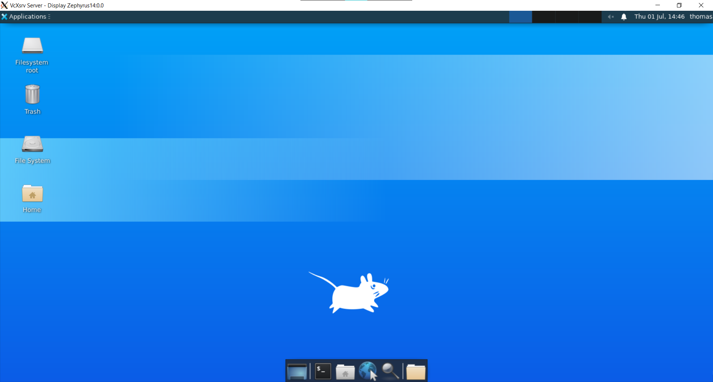

:house: [**Retour au menu principal**](/TChelp)

# Présentation de WSL

WSL (Windows Subsystem for Linux) est une fonctionnalité disponible sous Windows 10, permettant de faire tourner un environnement GNU/Linux sous Windows sans passer par une machine virtuelle traditionnelle ou un dual boot. Cela vous permettra d'accéder à un terminal Linux et, dans sa deuxième version intégrant un Kernel Linux entier, de faire tourner des modules incompatibles sous windows comme sysv_ipc.

WSL prend donc la forme d'un terminal de la distribution Linux choisi par l'utilisateur.

# Installation de WSL

L'Installation se fait en deux temps :
- Activer la fonctionnalité Windows Subsystem for Linux
- Installation de la distribution Linux

## Installation de WSL1 (rapide mais limité)

Pour activer la fonctionnalité WSL sous Windows 10, il suffit de rechercher
"Activer ou désactiver des fonctionnalités Windows" et de cocher la case Sous-système Windows pour Linux.
Vous pouvez aussi réaliser cette action en passant par le Powershell ouvert en tant qu'administrateur.
`dism.exe /online /enable-feature /featurename:Microsoft-Windows-Subsystem-Linux /all /norestart`

Si vous voulez utiliser WSL1 et ne pas passer à WSL2, redémarrez votre PC pour appliquer les modifications et passez directement à l'installation de la distribution Linux. Sinon, continuez simplement ce tutoriel.

## Mise à jour vers WSL2

Tout d'abord, vérifiez dans Windows Update que vous possédez bien la dernière version de Windows et que votre machine tourne sur un système x64. Quand cela est fait, on peut passer aux choses sérieuses.
Lancez le Powershell en tant qu'administrateur et activez la fonctionnalité "Plateforme de machine virtuelle" via la commande suivante:
`dism.exe /online /enable-feature /featurename:VirtualMachinePlatform /all /norestart`
Vous pouvez aussi réaliser cette action en allant dans "Activer ou désactiver des fonctionnalités Windows" comme auparavant et en activant la fonctionnalité en cochant sa case. Un redémarrage de l'ordinateur est nécessaire pour appliquer les modifications.

Ensuite, il vous faudra télécharger et installer le package de mise à jour Linux Kernel disponible [ici](https://wslstorestorage.blob.core.windows.net/wslblob/wsl_update_x64.msi).

Maintenant, vous possédez WSL1 et WSL2. Pour passer WSL2 en tant que version par défaut, executez cette commande dans le Powershell:
`wsl --set-default-version 2`

Ca y est, WSL2 est correctement installé sur votre machine et est prêt à l'emploi, il ne suffit plus que d'installer une distribution Linux.

# Installation de la distribution Linux sous WSL (1 et 2)

Après avoir activé WSL, il vous faut installer une distribution Linux. Pour cela, recherchez votre distribution sur le Windows Store (Ubuntu, Kali, SUSE, Debian, ...) et installez la. Vous la retrouverez dans vos programmes. Il vous suffira de la lancez pour accéder au terminal de celle-ci et de configurer votre username et mot de passe.
Félicitations, vous avez une distribution Linux sous Windows !

Notez que WSL est supporté nativement par le nouveau terminal développé en Open Source par Microsoft et vous permettra de lancer plusieurs distributions dans une seule application aux côtés de vos amis le cmd et le Powershell.

# Et si je veux lancer des interfaces graphiques avec WSL ?

WSL va bientot permettre via une mise à jour (WSLg) de lancer des interfaces graphiques en utilisant le kernel Linux. Cette mise à jour devrait arriver d'ici la fin d'année 2021 et va largement simplifier le lancement d'interfaces graphiques dans WSL.

Malgré cela, il est déjà possible de lancer des logiciels Linux sous le format graphique via un serveur X. Cela est faisable seulement avec WSL2.

Je préfère vous prévenir que la démarche n'est pas à 100% fonctionnel et qu'il est possible de rencontrer de nombreux bugs. Néanmoins, il vous sera possible d'installer des logiciels avec interfaces graphiques voire même des environnements de bureau comme xfce.

Pour cela, il vous faudra installer un logiciel supplémentaire, comme VcXsrv ici.
Il suffit donc de télécharger et d'installer le logiciel à ce [lien](https://sourceforge.net/projects/vcxsrv/)

Ce serveur X sera utilisé comme un moniteur virtuel pour les interfaces lancées dans WSL.

Ensuite, il vous suffit de lancer XLaunch dans notre cas.

Sur cet écran, vous pouvez choisir soit de lancer soit une grande fenêtre soit de multiples fenêtres.

Laissez les paramètres définis par défaut sur cet écran

Enfin, cochez "Disable access control" pour éviter les problèmes d'autorisation d'accès au moniteur. ATTENTION, cela rend le moniteur accessible seulement via une addresse IP, donc peu sécurisé.

Selon ce que vous avez choisi au premier écran, soit rien n'apparait, soit une fenêtre noire.

Maintenant, revenons à WSL. Lancez votre distribution et récupérez l'IP de l'host via la commande suivante :
`cat /etc/resolv.conf`.

Il faut ici récupérer l'addresse Nameserver et mettre à jour la variable d'environnement DISPLAY avec celle-ci :
`export DISPLAY = [adresse IP]:0.0`
, ce qui donne dans mon cas `export DISPLAY=172.18.208.1:0.0`.

Il est l'heure de tester si tout fonctionne ! Pour cela, installez une interface graphique. Ici, je teste avec gvim, l'interface graphique de Vim. installez le via la commande :
`sudo apt-get install gvim`

Ensuite, avec le serveur X allumé, lancez la commande `gvim` et normalement, vous verrez apparaître la fenêtre de gvim dans la fenêtre XLaunch.

Et voilà, vous avez lancé un logiciel Linux avec interface graphique dans WSL. Notez qu'il peut y avoir des problèmes d'affichages, de son, etc.

Si vous voulez expérimenter un petit peu, il est même possible de lancer un environnement de bureau comme xfce ([exemple de tutoriel](https://solarianprogrammer.com/2017/04/16/windows-susbsystem-for-linux-xfce-4/)), ce qui donne ceci :

## Les erreurs

Si vous avez une erreur du type `cannot open display`, vérifiez la variable d'environnement DISPLAY ainsi que le Firewall de Windows qui peut bloquer la connexion au serveur X ([Problème du Firewall](https://stackoverflow.com/questions/61860208/wsl-2-run-graphical-linux-desktop-applications-from-windows-10-bash-shell-erro)).

Pour l'erreur `Authorization required, but no authorization protocol specified`, celle-ci vient de l'option `Disable access control`. Vous trouverez des solutions différentes sur Internet, n'hésitez pas à les tester si vous ne voulez pas activer cette option dans XLaunch.

Si vous détectez d'autres erreurs qui bloquent le lancement, n'hésitez pas à laisser des issues sur TCHelp et à rechercher sur Internet, il y a pas mal d'utilisateurs et de docs (disponibles dans les ressources).

# Ressources
[https://docs.microsoft.com/en-us/windows/wsl/](https://docs.microsoft.com/en-us/windows/wsl/)
[https://doc.ubuntu-fr.org/wsl#installer_un_serveur_x](https://doc.ubuntu-fr.org/wsl#installer_un_serveur_x)
[]