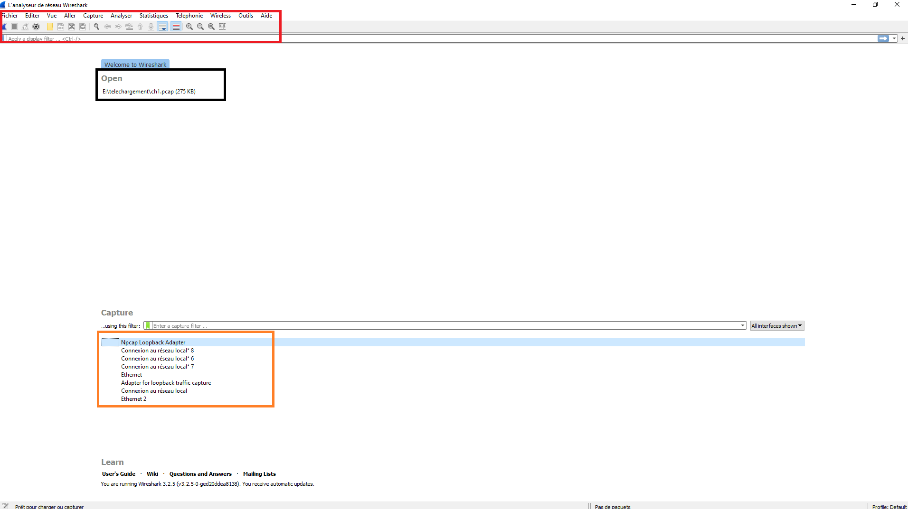
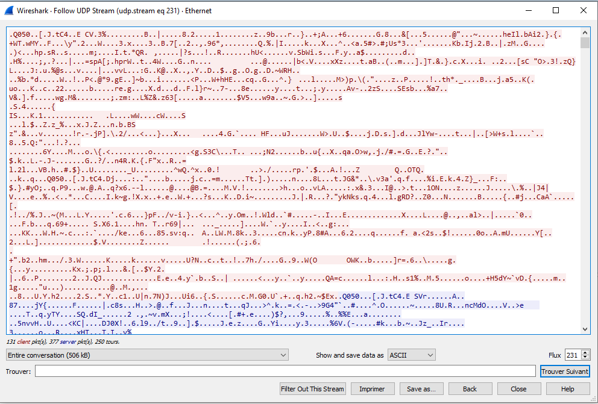

# Présentation de Wireshark

>  © Icône officielle de l'application
 
## Qu'est ce que Wireshark
 
Wireshark est un logiciel libre d'analyse de paquets réseaux.
Vous en aurez besoin dans un bon nombre de matières en 3TC.
Son principe est simple, il lit tout ce qui transite par votre carte réseau et vous l'affiche paquet par paquet.

## Installation

Vous trouverez les exécutables en fonctions de votre OS [ici](https://www.wireshark.org/download.html)

## Lancement

Je vous recommande de lancer Wireshark en mode administrateur sous windows ou en sudo sous Unix.

Vous arrivez normalement sur cette page :

### Lancer une capture

Cliquez sur le bouton bleu

### Suivre un steam

Faites un clic gauche sur un paquet, puis sur 'Steam' et suivez le stream

